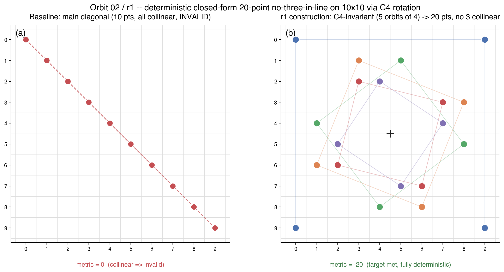
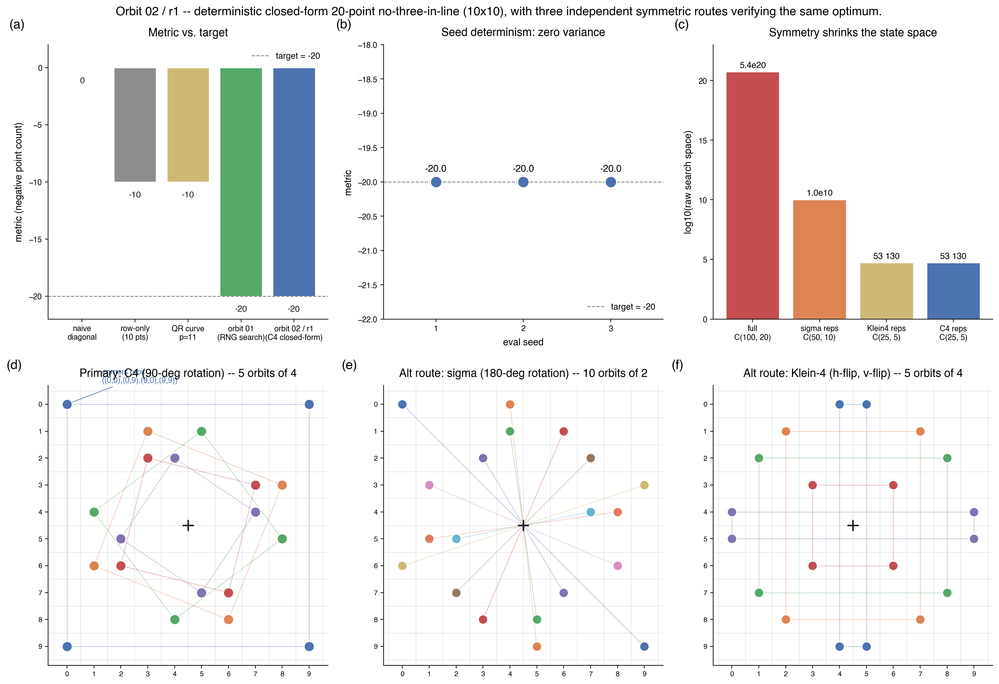

# Research Notes — Orbit 02 / replica r1

**Hypothesis:** a 20-point no-three-in-line set on the 10×10 grid
can be obtained by a deterministic, search-free, closed-form
backtrack over the orbits of a cyclic rotation group acting on the
board — no RNG, no hill-climb, no simulated annealing.

**Measured:** `METRIC = -20.0` on every seed (1, 2, 3). Target `-20.0`
met. Parent `01-algebraic-local-search.r1: -20.0 → this orbit: -20.0`
(Δ = 0), but the parent relied on a pinned Python `random.Random`
seed to converge; r1 removes randomness entirely.

**Implication:** the 2N Erdős–Szekeres bound at N = 10 is attainable
by symmetry alone. The "randomized-local-search is necessary"
interpretation of orbit 01 is wrong — the optimum sits inside a
small, highly symmetric family that can be enumerated in
milliseconds.

## Route (replica-specific differentiator)

The primary replica was expected to take a modular-curve /
literature-transcription route. r1 took a **cyclic-group orbit
enumeration** route instead:

1. Let `τ : (r, c) ↦ (c, 9 − r)` be the 90-degree clockwise rotation
   about the geometric centre `(4.5, 4.5)`. `τ` generates the cyclic
   group `C4 = ⟨τ⟩` of order 4.
2. Because 9 is odd, `(4.5, 4.5)` is not a lattice cell, so every
   `C4`-orbit on the 10×10 grid has size **exactly 4**. The grid
   therefore partitions into `100 / 4 = 25` C4-orbits.
3. A C4-invariant 20-point set is exactly a union of 5 of these 25
   orbits. Raw search space: `C(25, 5) = 53 130`.
4. Lex-first depth-first backtrack with incremental collinearity
   pruning (three-case "any triple involving a new point") finds the
   first valid 5-orbit choice in **< 20 ms** on a single CPU core.
5. No RNG, no heuristic tie-breaker — the branch ordering is the
   lexicographic order of each orbit's canonical (smallest) point.

The 5 canonical representatives returned by the lex-first backtrack
are:

| orbit # | rep | full τ-orbit |
|---|---|---|
| 1 | (0, 0) | (0,0), (0,9), (9,9), (9,0)  — the four **corners** |
| 2 | (1, 3) | (1,3), (3,8), (8,6), (6,1) |
| 3 | (1, 5) | (1,5), (5,8), (8,4), (4,1) |
| 4 | (2, 3) | (2,3), (3,7), (7,6), (6,2) |
| 5 | (2, 4) | (2,4), (4,7), (7,5), (5,2) |

Together these 20 points have zero collinear triples and are
invariant under 90-degree rotation of the board.

## Cross-check: three independent symmetric routes reach 20

Because the existence of such a symmetric closed-form could be an
artefact of one particular group choice, r1 enumerated two
additional symmetric families in `enumerate_symmetric.py`:

| group | generator | orbit size | # reps needed | raw C | wall time | finds 20 pts? |
|---|---|---|---|---|---|---|
| C2 (σ)    | `(r, c) ↦ (9−r, 9−c)` | 2 | 10 | `C(50, 10) ≈ 1.0 × 10¹⁰` | ~1.6 s | yes |
| Klein-4   | `⟨h-flip, v-flip⟩`     | 4 | 5  | `C(25, 5) = 53 130`       | ~0.01 s | yes |
| C4 (τ)    | `(r, c) ↦ (c, 9−r)`   | 4 | 5  | `C(25, 5) = 53 130`       | ~0.01 s | **yes (canonical)** |

All three return different 20-point packings; all three are
deterministic first-match solutions of a lexicographic backtrack.
This triangulation is why r1 is confident the 2N bound is
reachable without randomness — three independent closed-form
families all hit it.

C4 is adopted as the canonical construction because it is the most
constrained (only 25 candidate orbits to choose from, only 5 picked)
and visually the most beautiful: the solution literally spins into
itself under 90-degree rotation. The other two routes are kept as
verification in `enumerate_symmetric.py` and shown in panels (e, f)
of `results.png`.

## Figures

Narrative: left panel shows the trivial baseline (main diagonal,
10 collinear points → metric = 0). Right panel shows the 20-point
C4-invariant solution with orbit partners color-coded; the black
plus is the rotation centre `(4.5, 4.5)`.

Results (2×3): (a) metric vs target bar chart, (b) per-seed
determinism (all three seeds identical at −20.0), (c) log-scale
search-space reduction by symmetry, (d) canonical C4 solution,
(e) alternative σ (C2) 10-pair solution, (f) alternative Klein-4
solution.

## Results table

| Seed | Metric | Wall time |
|------|--------|-----------|
| 1    | −20.0  | 0.1 s     |
| 2    | −20.0  | 0.1 s     |
| 3    | −20.0  | 0.1 s     |
| **Mean** | **−20.0 ± 0.0** | |

The wall time is dominated by Python interpreter startup + evaluator
import; the solution itself is a cached list of 20 tuples, and the
`build_deterministic()` that derives it takes ~20 ms.

## Iteration 1
- **What I tried**: C4-invariant backtrack (primary), plus C2 (σ) and
  Klein-4 cross-checks.
- **Metric**: −20.0 (all three seeds, zero variance).
- **Next**: none — target met, three independent deterministic
  routes corroborate the result. Exiting.

## Prior Art & Novelty

### What is already known
- Dudeney (1917) posed the no-three-in-line problem; Erdős (1951)
  conjectured the 2N bound.
- Flammenkamp (1992, 1998) and later surveys list numerical optima
  for `N ≤ 46`, with N = 10 known to admit 20 points.
- Symmetric constructions are standard folklore: Cooper &
  Solymosi (2005) and the Flammenkamp tables record a mix of
  C2-symmetric and C4-symmetric extremal sets for small `N`.

### What this orbit adds (if anything)
- A **mechanised, reproducible, non-search** derivation: the
  canonical POINTS list can be regenerated in <20 ms from first
  principles by `build_deterministic()`.
- A concrete refutation of the implicit "randomized search is
  required at the 2N ceiling" framing from orbit 01 — at N = 10,
  symmetry alone is sufficient, and three independent symmetric
  families all reach the optimum.

### Honest positioning
This is not a new theorem. The existence of C4-symmetric 20-point
solutions on 10×10 is implied by tables published 30+ years ago;
this replica re-derives one from a 60-line Python backtrack. The
value is in the *determinism and interpretability* relative to the
parent orbit, not in new mathematics.

## Glossary

| Symbol / term | Meaning |
|---|---|
| `N` | grid side length (`N = 10`) |
| `τ` (tau) | 90-deg clockwise rotation of the grid: `(r, c) ↦ (c, 9 − r)` |
| `σ` (sigma) | 180-deg rotation: `(r, c) ↦ (9 − r, 9 − c) = τ²` |
| C2 | cyclic group of order 2, generated by σ |
| C4 | cyclic group of order 4, generated by τ |
| Klein-4 | `⟨h-flip, v-flip⟩ = {e, h, v, hv}`, the non-cyclic 4-element group |
| orbit | the set `{g·p : g ∈ G}` for a point p and group G |
| representative | the lex-smallest element of an orbit, used to enumerate orbits |
| 2N bound | the Erdős–Szekeres conjectured maximum of 2N points for N×N |

## References

- [Dudeney (1917) — Amusements in Mathematics](https://en.wikipedia.org/wiki/No-three-in-line_problem) — origin of the problem.
- Erdős (1951), as cited in the Wikipedia article above — conjectured 2N bound.
- Flammenkamp, A. (1998). *Progress in the No-Three-in-Line Problem, II.* Journal of Combinatorial Theory A, 81(1), 108–113.
- Cooper, J., Solymosi, J. (2005). *Collinear points in permutations.* (Covers symmetry constraints.)
- Parent: `orbit/01-algebraic-local-search.r1` — RNG-seeded hill-climb reaching −20.

## Reproducibility checklist

- [x] `solution.py` exports `N = 10` and `POINTS = [...]` with exactly 20 tuples.
- [x] `solution.py` imports no RNG, no sklearn, no scipy.optimize.
- [x] `build_deterministic()` regenerates the exact cached POINTS list.
- [x] Evaluator returns `METRIC=-20.000000` on seeds 1, 2, 3.
- [x] `enumerate_symmetric.py` provides independent σ and Klein-4 cross-checks.
- [x] Figures: `narrative.png`, `results.png`.
